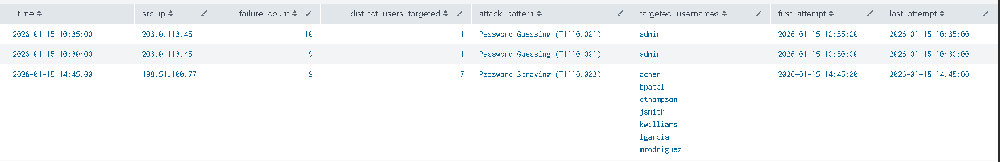
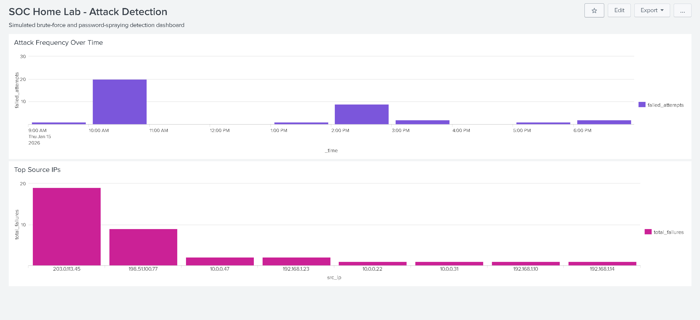

# Security Monitoring Home Lab

A simulated Security Operations Center (SOC) environment built to practice log ingestion, correlation, detection engineering, and alert triage using Splunk SIEM.

**Author:** Steven Johnson — Cybersecurity Analytics & Operations, Penn State University
[LinkedIn](https://linkedin.com/in/steven-johnson-63b3a7247) | [GitHub](https://github.com/stevejohns123) | Security+ Certified

---

## Overview

This lab simulates a small enterprise network under active attack. The goal was to build hands-on experience with the full SOC workflow — from raw log ingestion through detection engineering to incident triage — rather than just learning Splunk's interface in isolation.

**What this project demonstrates:**
- Standing up a SIEM pipeline from scratch (data onboarding, index configuration, field extraction)
- Writing custom detection logic in Splunk's Search Processing Language (SPL)
- Mapping detections to the [MITRE ATT&CK](https://attack.mitre.org/) framework
- Building analyst-facing dashboards for triage and investigation
- Documenting findings the way a real SOC analyst would communicate them to a team

---

## Lab Architecture

```
┌─────────────────┐        ┌──────────────────┐        ┌────────────────────┐
│  Simulated       │        │                  │        │                    │
│  Client/Server   │──logs─▶│   Splunk SIEM    │──SPL──▶│   Detection Rules  │
│  Environment     │        │  (Ingestion &    │        │   & Dashboards     │
│                  │        │   Indexing)       │        │                    │
└─────────────────┘        └──────────────────┘        └────────────────────┘
        │                                                         │
        │                                                         ▼
        │                                              ┌────────────────────┐
        └── Auth logs, network logs ──────────────────▶│  MITRE ATT&CK      │
                                                         │  Mapping            │
                                                         └────────────────────┘
```

**Components:**
| Component | Purpose |
|---|---|
| Splunk Enterprise (free tier) | Log ingestion, indexing, search, and dashboarding |
| Simulated auth logs | Source data for brute-force detection (see [Data Sources](#data-sources)) |
| Custom SPL detection rules | Identify malicious patterns in ingested data |
| MITRE ATT&CK mapping | Ties each detection to a known adversary technique |

> Full architecture diagram with actual network topology and data flow: [`docs/architecture.md`](docs/architecture.md)

---

## Detection Engineering: Brute-Force Authentication Attacks

The core detection built in this lab identifies brute-force login attempts — repeated failed authentication attempts from a single source in a short time window, a pattern mapped to [MITRE ATT&CK T1110 (Brute Force)](https://attack.mitre.org/techniques/T1110/).

**Detection logic:** Flag any source IP with 5+ failed authentication events against the same or different accounts within a 5-minute window.

See the full annotated query: [`spl-queries/brute_force_detection.spl`](spl-queries/brute_force_detection.spl)

**MITRE ATT&CK Mapping:**

| Detection | Technique ID | Technique Name | Tactic |
|---|---|---|---|
| Repeated auth failures, single source | T1110.001 | Brute Force: Password Guessing | Credential Access |
| Repeated auth failures, multiple accounts, single source | T1110.003 | Brute Force: Password Spraying | Credential Access |

Full mapping writeup: [`docs/mitre-attack-mapping.md`](docs/mitre-attack-mapping.md)

### Results

Running the detection query against the lab's ingested auth logs correctly surfaced both attack patterns present in the data:



- `203.0.113.45` flagged as **Password Guessing (T1110.001)** — 19 failed attempts against a single account (`admin`) in under 10 minutes
- `198.51.100.77` flagged as **Password Spraying (T1110.003)** — failed attempts spread across 7 distinct accounts, consistent with an attacker trying to avoid per-account lockout thresholds

---

## Dashboards

A two-panel dashboard was built to support analyst triage:

1. **Attack Frequency Over Time** — hourly count of failed-auth events, used to spot spikes indicating active attacks
2. **Top Source IPs** — ranks source IPs by failed-auth volume, used to identify likely attacker infrastructure



Both attacker IPs are immediately visible against normal background authentication traffic — the attack frequency panel shows two clear spikes (a brute-force burst around 10 AM, a password-spraying burst around 2 PM), and the top-source-IPs panel ranks both malicious IPs well above any legitimate internal host.

---

## Data Sources

This lab uses simulated/synthetic authentication log data (no real production or personally identifiable data). Example log format:

```
2026-01-15 14:32:07 host=web-srv-01 src_ip=203.0.113.45 user=admin action=failure reason=invalid_password
```

---

## Skills Demonstrated

`Splunk SIEM` `SPL (Search Processing Language)` `Log Analysis` `MITRE ATT&CK` `Detection Engineering` `Incident Triage` `SOC Workflows`

---

## Roadmap / Next Steps

- [ ] Integrate Active Directory + Sysmon logging for endpoint visibility
- [ ] Add automated attack simulation using Atomic Red Team
- [ ] Build Python automation for log parsing and threat-intel API enrichment (VirusTotal / AlienVault OTX)
- [ ] Expand detections beyond brute-force (e.g., lateral movement, data exfiltration patterns)

---

## Related Projects

- [`CodePath-Phishing-Analysis`](#) — Wireshark-based SMTP phishing investigation (500+ packet captures analyzed)
- [`AI-Threat-Intel-RAG`](#) — RAG-based knowledge base design for AI-assisted GRC/threat intelligence workflows
